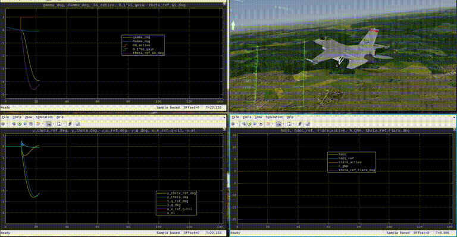

# F-16 Pitch Stability Augmentation and Landing Controller

... solving the tasks connected to the Delft Aerospace Engineering Course AE4301-P(roject).

Group: 
- tblaha, 4597176
- lkaffa
- afrancken


## Usage

The following assumes that either...
- ... the provided `nlplant.mex*` files (compiled for Win10, Linux and MacOS) work on your machine (`ExternalModules/F16Sim/nlplant.mex*`) and you don't get errors from them when running this project
- ... OR: you have deleted those `nlplant.mex*` files that don't work and replaced them with a compatible `nlplant.mex*` file that you have obtained elsewhere.
- ... OR: you have deleted those `nlplant.mex*`files that don't work and you have a supported `c` Compiler on your system (for instance `gcc`) that is setup for MATLAB (see links below). In that case you don't have to do anything more as `setup.m` will attempt compilation if it doesn't find `nlplant.mex*` files.
    - 
    - 

Also, the the code has been verified using the following MATLAB/Simulink and Toolbox versions:
```
MATLAB                                                Version 9.6         (R2019a)
Simulink                                              Version 9.3         (R2019a)
Aerospace Blockset                                    Version 4.1         (R2019a)
Aerospace Toolbox                                     Version 3.1         (R2019a)
Control System Toolbox                                Version 10.6        (R2019a)
Optimization Toolbox                                  Version 8.3         (R2019a)
Robust Control Toolbox                                Version 6.6         (R2019a)
Statistics and Machine Learning Toolbox               Version 11.5        (R2019a)
Symbolic Math Toolbox                                 Version 8.3         (R2019a)
```

### Quick and Clean

The way to quickly get all results presented in the report; at once.

1. point MATLAB to the root directory
2. open file `main.mlx` (it's a "matlab live script"; idea probably stolen from Jupyter)
3. Run it entirely, or piece by piece and observe inline outputs and plots


### Slow and Dirty

1. point MATLAB to the root directory
2. run `setup.m`
3. set the `show_plots` variable to either `"on"` or `"off"` (can simply be done in the console)
4. run any of the subparts independently (like `Ch5_OpenLoop.m`)


### Bonus: FlightGear interface



The full movie on youtube: [www.youtube.com/watch?v=lUQh3Rl52io](https://www.youtube.com/watch?v=lUQh3Rl52io)

For a nice visualization:
1. install FlightGear [http://wiki.flightgear.org](http://wiki.flightgear.org)
2. adapt your installation-path in `runfg.sh` (tested on Linux) or `runfg.bat` (untested!)
3. run `runfg.{sh|bat}` --> FlightGear should show an F-16CJ on the ground somewhere
4. prepare MATLAB workspace by running
    - `setup.m`
    - `Ch7_Landing.m`
5. Uncomment the "Simulation Pace" block in the Top-Level of `SLModels/Landing.slx` and make sure it's set to `1` (real-time)
6. Run the Simulink simulation (`Landing.slx`)


## Credits

We use a number of submodules in this repo (although regrettably, the haven't been implemented as
proper git submodules ;-) ). They are attributed as follows:
1. `ExternalModules/F16Sim/` 
    - "Non-linear F-16 Simulation using Simulink and MATLAB"
    - Richard S. Russell
    - University of Minnesota, 2003
    - Obtained from [www.researchgate.net/publication/2881317...](https://www.researchgate.net/publication/2881317_Non-linear_F-16_Simulation_using_Simulink_and_Matlab)
2. `ExternalModules/export_fig/`
    - "export_fig"
    - Yair Altman
    - Github, 2020 [github.com/altmany/export_fig/releases/tag/v3.14](https://github.com/altmany/export_fig/releases/tag/v3.14)
    - Obtained from MATLAB Central File Exchange [www.mathworks.com/matlabcentral/fileexchange/23629-export_fig](https://www.mathworks.com/matlabcentral/fileexchange/23629-export_fig)
3. `ExternalModules/FlightGearAircraft/f16/`
    - "General Dynamics F-16 Fighting Falcon (for FlightGear)"
    - Erik Hofman et at.
    - SourceForge, 2020 [sourceforge.net/p/flightgear/fgaddon/HEAD/tree/trunk/Aircraft/f16/](http://sourceforge.net/p/flightgear/fgaddon/HEAD/tree/trunk/Aircraft/f16/)
    - Obtained from [wiki.flightgear.org/General_Dynamics_F-16_Fighting_Falcon](http://wiki.flightgear.org/General_Dynamics_F-16_Fighting_Falcon)
4. `ExternalModules/AssignmentPDFs/F16Sim_Manual.pdf`
    - "Practical assignment AE4-301P: Exercise Automatic Flight Control System Design"
    - Ewoud van Kampen
    - TU Delft, 2020
    - Obtained from BrightSpace

